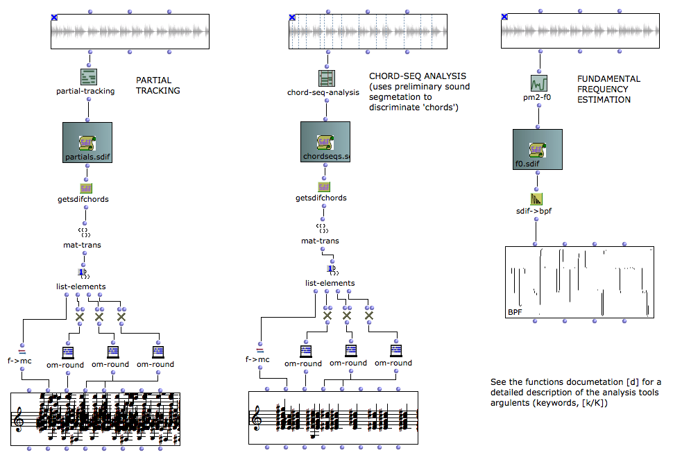
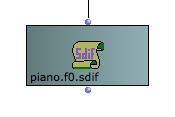

# om-pm2

A connection to IRCAM **pm2** additive analysis/synthesis kernel in OM visual programs.

OM-pm2 library for OM by Jean Bresson (c) IRCAM 2006-2018

pm2 is developed and distributed by IRCAM - Analysis/Synthesis team

*************
This program is free software. It is distributed in the hope that it will be useful, but WITHOUT ANY WARRANTY, without even the implied warranty of MERCHANTABILITY or FITNESS FOR A PARTICULAR PURPOSE. 

_This library does NOT include pm2 sources or binaries, which must be installed separately and located in the SuperVP section of OM Preferences/Libraries tab._

*************

## Description

The OM-pm2 library allows to perform additive analysis and extract the partials from audio files using the pm2 sound processing kernel.

It also performs the "chord-seq" analysis, which extracts the main partial as chords with given time intervals.

Finally, OM-pm2 allows to resynthesize sounds from lists or partials or chord-seqs using an additive syntehsis model.

## Configuration

Once the OM-pm2 library is loaded in OM, a new item will appear in the Externals tab of the OM Preferences window. OM will display the kernel path in red if it is not found or not set correctly.

Depending on your distribution, pm2 might or might not be present in your library package. If needed you can specify the path to another location where it might be installed (e.g. within the AudioSculpt application package: the sound processing kernels can be found inthe AudioSculpt x.x.x/Kernels/ folder).

## File formats

All pm2 sound analyses results are stored ans returned as [SDIF](http://sdif.sourceforge.net/)  files : the analysis functions return a file pathname to connect to the **SDIFFile** object in OM.

SDIF file contents can be inspected and converted to data lists or OM objects using the SDIF package tools.

The default location for reading/writing the files can be set in the OM Preferences.

**More on SDIF: http://sdif.sourceforge.net/**

